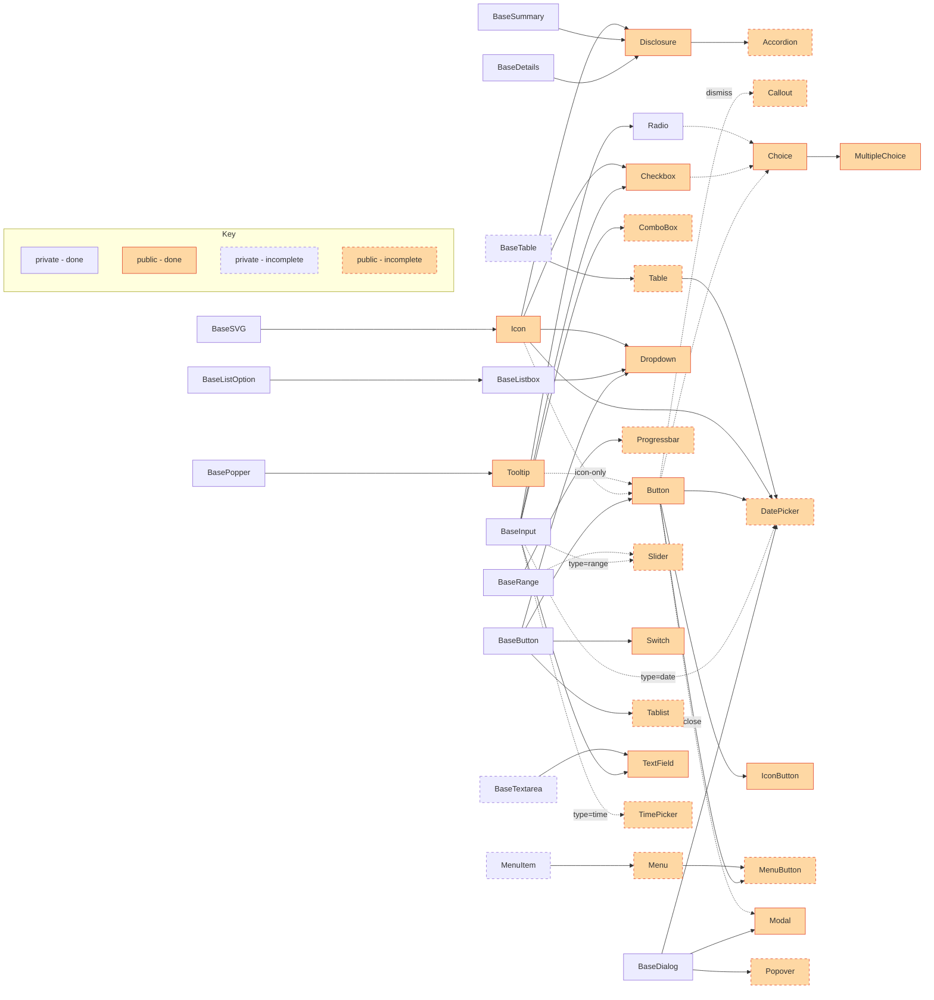

# Components

The following [Mermaid flowchart](https://mermaid-js.github.io/mermaid/#/flowchart) is a graph of the design system's components.

- Arrows represent a dependency relationship where `[A]-->[B]` means that `[B]` uses `[A]` in some way.
- Dotted arrows represent an optional relationship where `[A]-.->[B]` means that `[B]` _can_ use `[A]` in some way.
- Text inside an arrow represents a more specific relationship.

