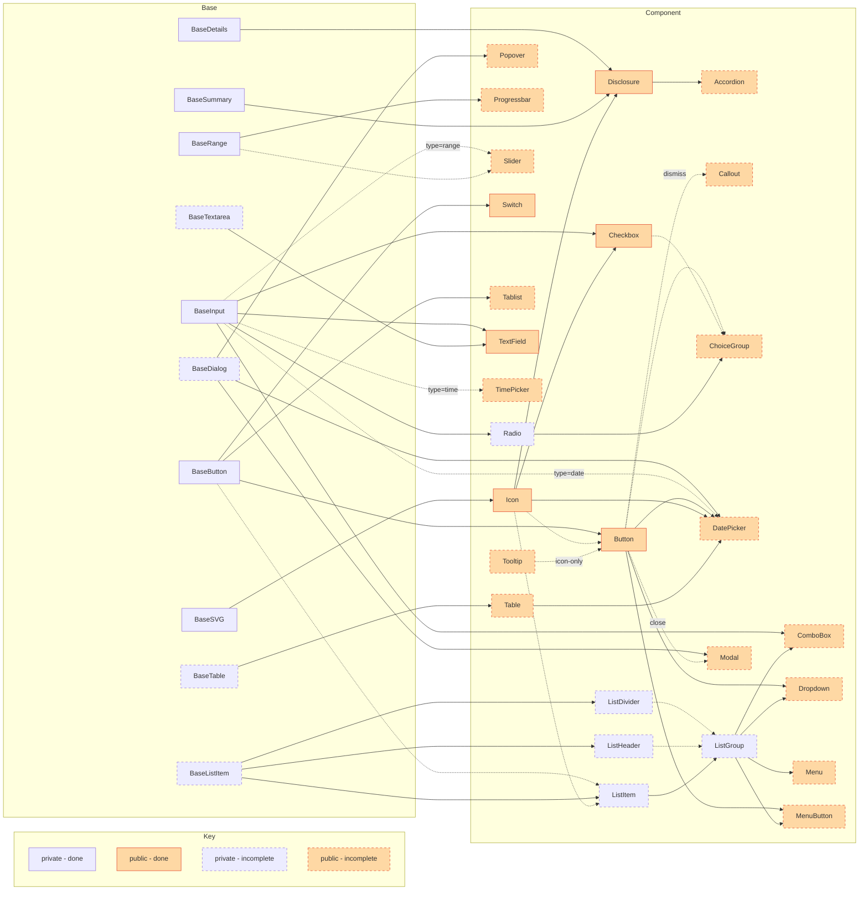

# Components

The following [Mermaid flowchart](https://mermaid-js.github.io/mermaid/#/flowchart) is a graph of the design system's components.

```mermaid
graph LR
  subgraph Key
  private[private - done]
  public[public - done]
  private-ic[private - incomplete]
  public-ic[public - incomplete]
  end

  subgraph Base
  BaseButton
  BaseDetails
  BaseDialog
  BaseInput
  BaseListItem
  BaseRange
  BaseSummary
  BaseSVG
  BaseTable
  BaseTextarea
  end

  subgraph Component
  Accordion
  Button
  Callout
  Checkbox
  ChoiceGroup
  ComboBox
  DatePicker
  Disclosure
  Dropdown
  Icon
  ListDivider
  ListGroup
  ListHeader
  ListItem
  Menu
  MenuButton
  Modal
  Popover
  Progressbar
  Radio
  Slider
  Switch
  Table
  Tablist
  TextField
  TimePicker
  Tooltip
  end

  BaseButton --> Button
  BaseButton --> Switch
  BaseButton --> Tablist
  BaseButton -.-> ListItem
  BaseDetails --> Disclosure
  BaseDialog --> DatePicker
  BaseDialog --> Modal
  BaseDialog --> Popover
  BaseInput --> Checkbox
  BaseInput --> ComboBox
  BaseInput --> Radio
  BaseInput --> TextField
  BaseInput -. type=date .-> DatePicker
  BaseInput -. type=range .-> Slider
  BaseInput -. type=time .-> TimePicker
  BaseListItem --> ListDivider
  BaseListItem --> ListHeader
  BaseListItem --> ListItem
  BaseRange --> Progressbar
  BaseRange -.-> Slider
  BaseSummary --> Disclosure
  BaseSVG --> Icon
  BaseTable --> Table
  BaseTextarea --> TextField
  Button --> DatePicker
  Button --> Dropdown
  Button --> MenuButton
  Button -. "close" .-> Modal
  Button -. "dismiss" .-> Callout
  Button -.-> ChoiceGroup
  Checkbox -.-> ChoiceGroup
  Disclosure --> Accordion
  Icon --> Checkbox
  Icon --> DatePicker
  Icon --> Disclosure
  Icon -.-> Button
  Icon -.-> ListItem
  ListDivider -.-> ListGroup
  ListGroup --> ComboBox
  ListGroup --> Dropdown
  ListGroup --> Menu
  ListGroup --> MenuButton
  ListHeader -.-> ListGroup
  ListItem --> ListGroup
  Radio --> ChoiceGroup
  Table --> DatePicker
  Tooltip -. icon-only .->Button

  classDef exports fill:#fed8a4,stroke:#e24329;
  classDef incomplete stroke-dasharray: 5, 5;

  class public,public-ic,Accordion,Button,Callout,Checkbox,ChoiceGroup,ComboBox,DatePicker,Disclosure,Dropdown,Icon,Menu,MenuButton,Modal,Popover,Progressbar,Slider,Switch,Table,Tablist,TimePicker,TextField,Tooltip exports;

  class private-ic,public-ic,BaseDialog,BaseListItem,BaseTable,BaseTextarea,Accordion,Callout,ChoiceGroup,ComboBox,DatePicker,Dropdown,ListDivider,ListGroup,ListHeader,ListItem,Menu,MenuButton,Modal,Popover,Progressbar,Slider,Radio,Table,Tablist,TimePicker,Tooltip incomplete;
```
